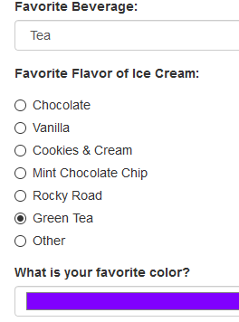
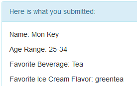

# _Survey Practice_

#### _Exercise in jQuery Form Input Types, 01.15.2020_

#### By _**Tiffany Siu**_

## Description

This program is an exercise in jQuery and javascript form input types.  It is a survey of different information from the user, using all the different form input types learned up to when this program was created.  Form input types include text, drop down menus, radio buttons, color picker, and date picker.

## Setup/Installation Requirements

### Requirements to Run
* _Web Browser_

### Other Resources Used
* _JQuery_
* _Bootstrap_

### Instructions
_This page may be viewed by cloning the [repository](https://github.com/TSiu88/survey.git) from my [GitHub page](https://github.com/TSiu88) and opening the **index.html** file in any web browser._

## Technologies Used

* _HTML_
* _CSS_
* _Javascript_
* _JQuery_
* _Bootstrap_
* _Markdown_

## Notable Features
_This program showcases different input types including more unusual ones like color picker._

## Specifications

* _Take in input from the user on survey questions and save in javascript_
  * _Example Input: Favorite ice cream flavor = "Green Tea"_
  * _Example Output: save ice cream = "Green Tea"_
* _When survey submitted, show panel with responses given._
  * _Example Input: Name= Mon Key, Drink= Tea_
  * _Example Output: What you submitted: Name: Mon Key, Favorite Drink: Tea _
* _After submission, disable submit button for survey_
  * _Example Input: click "Submit"_
  * _Example Output: Submit button disabled_

## Screenshots

_Here is a snippet of what some of the input looks like:_

_Here is a preview of what some of the output looks like:_

## Known Bugs

_There are currently no known bugs in this program_

## Support and contact details

_If there are any question or concerns please contact me at my [email](mailto:tsiu88@gmail.com). Thank you._

### License

*This software is licensed under the MIT license*

Copyright (c) 2020 **_Tiffany Siu_**
